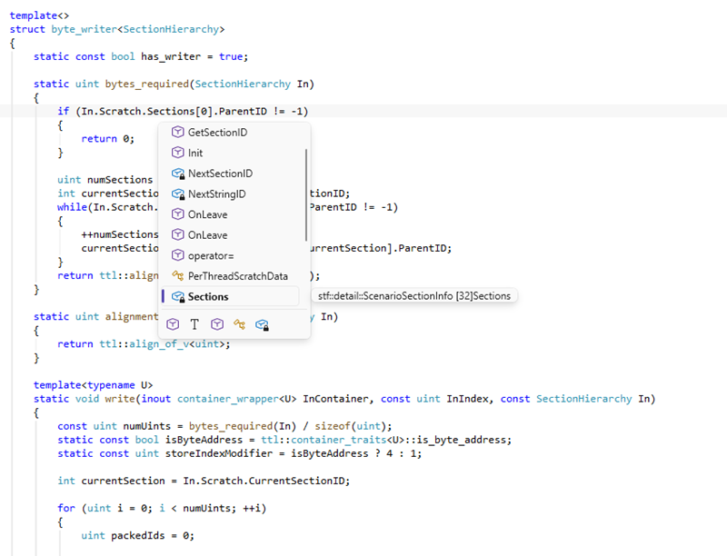
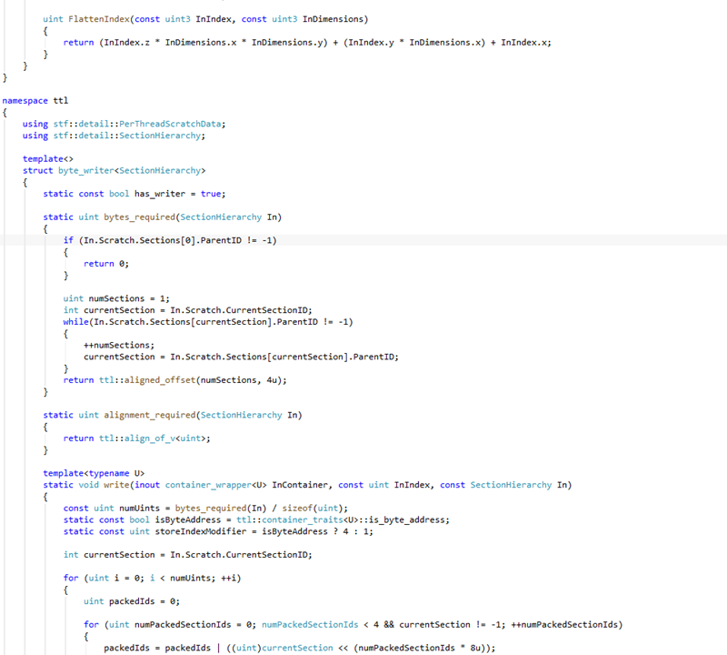
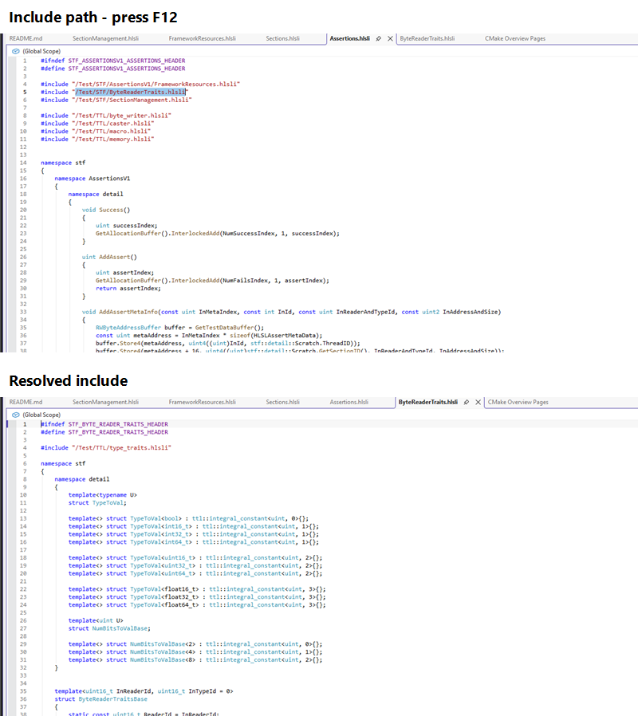
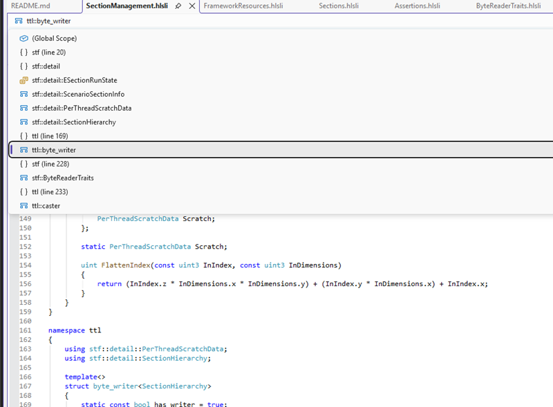
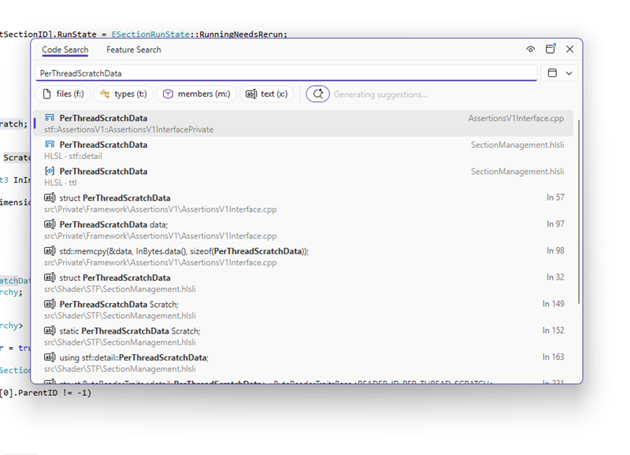

# HLSL-LSP

This project was generated with GitHub Copilot.

An editor-independent HLSL language server built around DXC's
`IDxcIntelliSense` API. The `hlsl-lsp` executable is an LSP 3.17 stdio server
with:

- UTF-16 incremental document synchronization
- DXC diagnostics for open HLSL documents
- DXC-backed code completion
- DXC-backed hover and signature help
- DXC-backed semantic colouring and go-to-definition for symbols and include paths
- Workspace symbol support for Visual Studio's All-In-One Search
- Hierarchical `shadertoolsconfig.json` compiler configuration
- Transitive, virtual, open-buffer, and dependency-aware include handling
- Bounded, cancellable, version-coalesced background analysis
- Visual Studio 2026 and Visual Studio Code clients under `clients/`

The Visual Studio extension serves a similar purpose to
[Tim Jones' HLSL Tools](https://github.com/tgjones/HlslTools), while using
DXC's IntelliSense API so it can understand modern HLSL language and shader
model features, including HLSL 2021 and Shader Model 6.6 resource descriptor
heap types.

> [!WARNING]
> **HLSL Tools compatibility:** HLSL Tools and HLSL-LSP integrate with the
> same Visual Studio HLSL file extensions and content-type pipeline. Enabling
> both extensions can prevent language features from activating reliably.
> Disable or uninstall HLSL Tools before installing HLSL-LSP.

## Features

### Code completion

HLSL-LSP provides context-aware completion for language constructs, user
symbols, templates, and DXC intrinsics. Trigger it with Visual Studio's normal
`Ctrl+J` or `Ctrl+Space` shortcuts.



### Hover and signature help

Hover reports DXC's symbol name, type, declaration, and source location.
Signature help reports stable labels and parameters for functions, overloaded
functions, and methods, including nested call sites and unsaved edits.

The pinned DXC `1.9.2607.13` API exposes no callable constructor overloads or
parameter cursors. Scalar casts resolve to an unnamed initializer expression;
`float4` and `float2x2` resolve to typedefs; and generic `vector` and `matrix`
resolve to class templates whose only callable children are subscript operators.
Completion provides `vector::` and `matrix::` qualification entries, not
constructor placeholders. It also rejects user-defined HLSL constructor
declarations. HLSL-LSP therefore returns `null` for constructor signature help
instead of fabricating signatures.

### Semantic colouring

Types, functions, variables, templates, preprocessor directives, and other
HLSL constructs receive dedicated classifications that integrate with Visual
Studio's Fonts and Colors settings.



### Go to definition

Press `F12` to navigate to symbol definitions or resolved `#include` files,
including files reached through virtual directory mappings.



### References and rename

Find All References and Rename use DXC cursor identity, so overloads and
same-named symbols in different scopes remain distinct. Searches cover every
analyzed root and its transitive includes, including open unsaved buffers.
Rename validates the new HLSL identifier, versions edits for open documents,
and rejects the operation if a disk source changed or disappeared after
analysis. The pinned DXC reference API does not expose macro definition or
expansion references, so Rename is not offered on macros. Unresolved or
generated sources that cannot be represented as file URIs are not renamed.

### Navigation bar

The native Visual Studio navigation bar tracks namespaces, types, functions,
and the current symbol in HLSL documents.



### All-In-One Search

Press `Ctrl+T` to find HLSL types and members across the workspace through
Visual Studio's All-In-One Search.



## Install the Visual Studio extension

### Download a release

The easiest way to install HLSL-LSP is to download
`HlslLsp.VisualStudio.vsix` from the
[latest GitHub release](https://github.com/KStocky/HLSL-LSP/releases/latest).
Close Visual Studio, run the downloaded VSIX, and follow the installer prompts.
Restart Visual Studio and open an `.hlsl` or `.hlsli` file; the bundled language
server starts automatically.

> [!NOTE]
> Release artifacts are not yet code-signed. Windows Smart App Control may
> block the extension or language server unless Developer Mode is enabled.

### Build the VSIX from source

Building requires Windows, Visual Studio 2026 with the MSVC C++ workload, and
CMake 3.28 or newer. From a Developer PowerShell prompt, build the Release
server first:

```powershell
cmake --preset windows-msvc
cmake --build --preset windows-msvc-release --target hlsl-lsp
```

Then locate Visual Studio's MSBuild and package that server into the VSIX:

```powershell
$vswhere = "${env:ProgramFiles(x86)}\Microsoft Visual Studio\Installer\vswhere.exe"
$msbuild = & $vswhere -latest -products * `
  -requires Microsoft.Component.MSBuild `
  -find MSBuild\**\Bin\MSBuild.exe |
  Select-Object -First 1
$serverDir = (Resolve-Path 'out\build\windows-msvc\Release').Path

& $msbuild `
  clients\visual-studio\HlslLsp.VisualStudio\HlslLsp.VisualStudio.csproj `
  /restore `
  /p:Configuration=Release `
  "/p:HlslLspServerDir=$serverDir"
```

The finished installer is:

```text
clients\visual-studio\HlslLsp.VisualStudio\bin\Release\net472\HlslLsp.VisualStudio.vsix
```

Close Visual Studio and run that file to install the extension.

## Install the Visual Studio Code extension

Download `hlsl-lsp-vscode.vsix` from the
[latest GitHub release](https://github.com/KStocky/HLSL-LSP/releases/latest),
then install it from the command line:

```console
code --install-extension hlsl-lsp-vscode.vsix
```

The VSIX bundles Windows x64 and Linux x64 servers with their matching DXC
runtimes. It activates for `.hlsl`, `.hlsli`, and `.usf`; other extensions can
use the `hlsl` language through VS Code's `files.associations` setting.

The build and release workflows package both platforms on Linux so the Linux
executable mode is preserved. For the complete local staging commands, see the
client README. A Windows-only development package can still be produced with:

```powershell
cd clients\vscode
npm ci
npm run stage:runtime -- --platform win32-x64 `
  --server-dir ..\..\out\build\windows-msvc\Release
npm run check
npm run package
```

The bundled client supports Windows x64 and glibc-based Linux x64. The
extension does not silently fall back when a configured or bundled runtime is
unavailable. See
[`clients/vscode/README.md`](clients/vscode/README.md) for configuration,
testing, path behavior, and current platform limitations.

## Development requirements

- Windows with Visual Studio 2026 and the MSVC C++ workload, or Linux x64 with
  Clang, Ninja, and glibc 2.38 or newer
- LLVM with `clang-format` and `clang-tidy` (`clang-cl` for that Windows preset)
- CMake 3.28 or newer
- Internet access for CMake's first configuration

CMake downloads checksum-verified official Microsoft DXC packages. Windows
uses `Microsoft.Direct3D.DXC` `1.9.2607.13`; Linux x64 uses the corresponding
official DXC `v1.9.2607` release and pinned compatibility header. See
[`docs/linux.md`](docs/linux.md) for artifact hashes, ABI requirements,
licensing, installation, runtime loading, and the safe reparse limitation.
Production tracing, crash diagnostics, resource limits, fuzzing, compatibility,
corpus scope, and reproducible packaging are documented in
[`docs/production.md`](docs/production.md).

To use a custom DXC build instead, set both `DXC_INCLUDE_DIR` and
`DXC_RUNTIME_DIR`. `DXC_INCLUDE_DIR` must directly contain `dxcisense.h`.

```powershell
cmake --preset windows-msvc `
  -DDXC_INCLUDE_DIR=C:\path\to\dxc\include\dxc `
  -DDXC_RUNTIME_DIR=C:\path\to\dxc\bin
```

## Build and test

```powershell
cmake --preset windows-msvc
cmake --build --preset windows-msvc-debug
ctest --preset windows-msvc-debug

cmake --preset windows-clangcl
cmake --build --preset windows-clangcl-debug
ctest --preset windows-clangcl-debug
```

On Linux x64:

```console
cmake --preset linux-clang
cmake --build --preset linux-clang-debug
ctest --preset linux-clang-debug
cmake --build --preset linux-clang-release --target hlsl-lsp
cmake --install out/build/linux-clang --config Release \
  --prefix out/package/linux-x64
```

All C++ tests use Catch2. First-party targets use C++23 and warnings as errors:
`/W4 /WX` with MSVC-compatible frontends and
`-Wall -Wextra -Wpedantic -Werror` with Linux Clang.

### Analysis scheduling, caching, and cancellation

Analysis notifications enqueue work instead of parsing on the protocol-input
thread. Two workers and a 64-item queue are used by default. A stable root-path
hash assigns each root to one worker; that worker creates, uses, reparses, and
destroys the root's DXC index and translation unit. Calls for one translation
unit are therefore serialized, while unrelated roots can run concurrently.
Superseded queued versions are coalesced and running obsolete work is prevented
from publishing diagnostics. Diagnostics and interactive results are checked
against the current document version before publication or return.

The translation-unit LRU defaults to 16 entries and a 256 MiB estimated budget.
The estimate is deliberately conservative rather than a claim about DXC's
unobservable COM heap: it charges 4 MiB per DXC translation unit plus retained
source text, paths, dependency strings, keys, and their C++ container storage.
The parsed-include-metadata LRU defaults to 512 entries and 8 MiB; its estimate
charges the retained source text, identities, directives, strings, and
containers. Limits are divided deterministically among workers. Entries are
evicted only by their owning idle worker and never while a DXC call is using
them.

`$/cancelRequest` is supported for integer and string request IDs. Queued work
returns LSP `RequestCancelled` (`-32800`) promptly. DXC exposes no safe
interrupt primitive for an in-flight COM call, so cancellation can return to
the client while that call finishes on its owning worker; its result is
suppressed and the translation unit is not accessed concurrently or destroyed
early. Shutdown cancels queued and active work, waits for any such DXC call,
then destroys DXC state on the same worker.

Defaults can be tuned with positive integer command-line arguments:

```text
--analysis-workers 2
--analysis-queue-capacity 64
--request-workers 4
--request-queue-capacity 64
--translation-unit-count 16
--translation-unit-memory-mb 256
--include-cache-count 512
--include-cache-memory-mb 8
```

Queue, entry, and memory capacities must be at least the analysis worker count.
The translation-unit memory budget must also provide at least the 4 MiB opaque
estimate per worker. A single analysis whose estimate exceeds its worker's
share can publish diagnostics but is not retained; interactive requests for
such a document are cancelled rather than exceeding the configured bound.
Literal include dependencies are tracked per root, so include and configuration
file changes do not reparse unrelated completed roots. Macro-computed includes
and roots whose first analysis is still pending conservatively depend on all
open documents until DXC analysis establishes precise metadata.

The checked-in representative shader benchmark reports cold parse, warm cache,
reparse, completion, hit/miss/eviction, and estimated-memory metrics:

```powershell
cmake --build --preset windows-msvc-debug --target hlsl-analysis-benchmark
out\build\windows-msvc\Debug\hlsl-analysis-benchmark.exe
```

CI runs the same utility as `analysis-structural-benchmark`. It asserts cache
and scheduling structure only; wall-clock values are reported and never used
as flaky pass/fail thresholds.

## Configuration

HLSL-LSP supports the `shadertoolsconfig.json` format created by Tim Jones for
[HLSL Tools](https://github.com/tgjones/HlslTools), together with additional
DXC-oriented settings. See the
[`shadertoolsconfig.json` reference](docs/shadertoolsconfig.md) for discovery,
merging, every supported property, path handling, examples, and editor-setting
precedence.

## License

HLSL-LSP is released under the permissive [MIT license](LICENSE).
