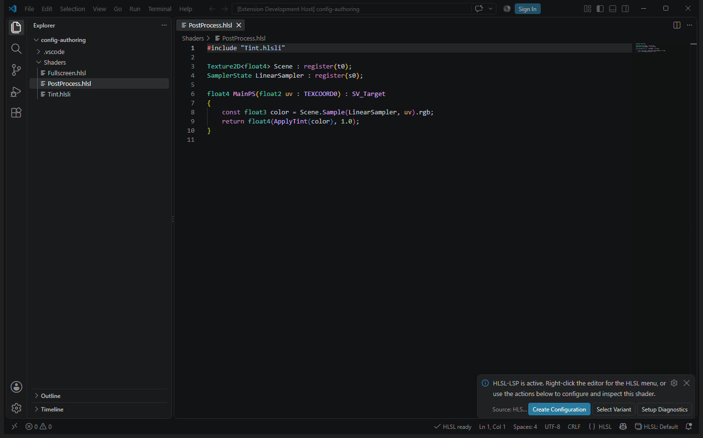
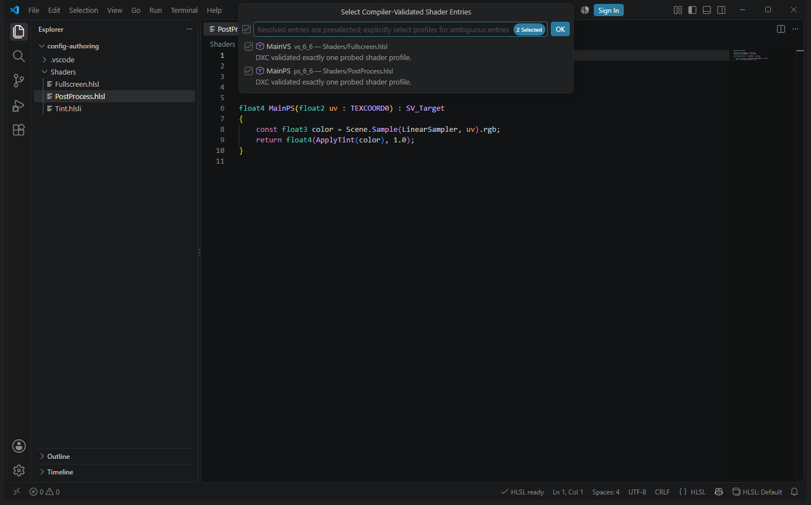
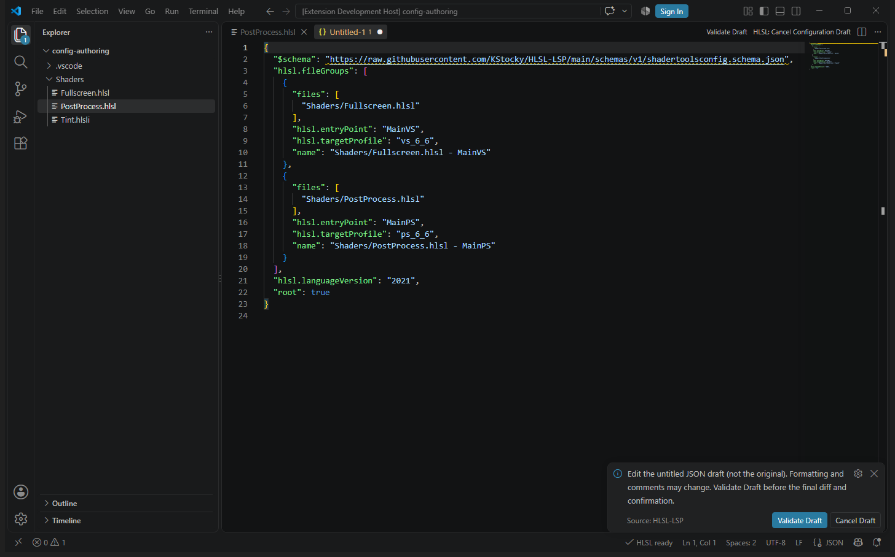
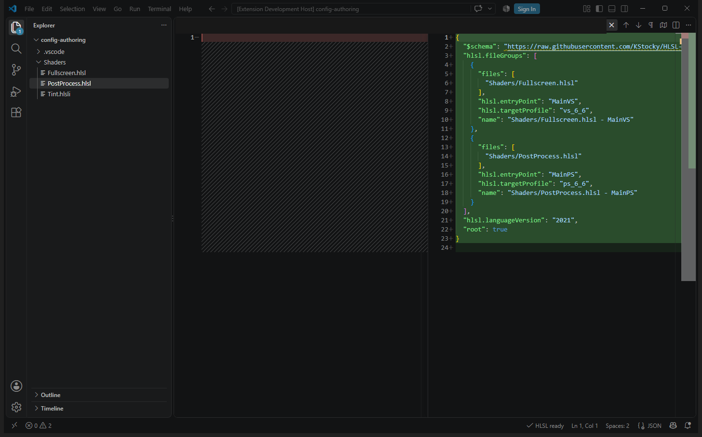
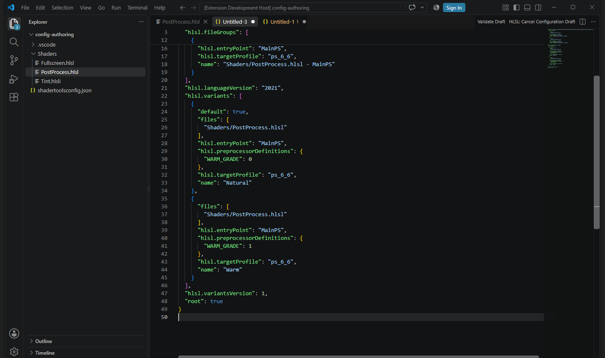
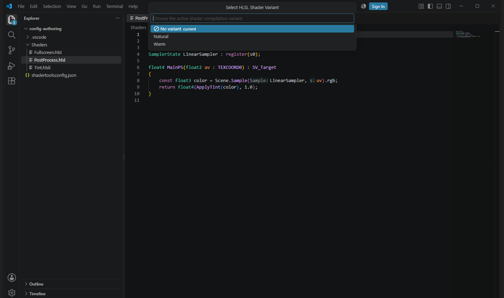

# Tutorial: create a shader configuration from compiler-validated entries

This walkthrough starts without `shadertoolsconfig.json`, discovers two shader
entry points, and adds two named pixel-shader permutations. The screenshots are
from the VS Code extension; the same server validates drafts in Visual Studio.

## 1. Open the example workspace

Open [`examples/config-authoring`](../../examples/config-authoring/) as a folder
in VS Code with HLSL-LSP installed. In Visual Studio, copy that directory beside
an open solution and use it as the solution's shader workspace. Keep the
extension's bundled DXC runtime enabled; no separate shader compiler is needed.
The starter intentionally contains **no** `shadertoolsconfig.json`.

The three checked-in files are:

```text
examples/config-authoring/
└── Shaders/
    ├── Fullscreen.hlsl    # MainVS, fullscreen triangle
    ├── PostProcess.hlsl   # MainPS, sampled scene texture
    └── Tint.hlsli         # WARM_GRADE-controlled color adjustment
```

Read [Fullscreen.hlsl](../../examples/config-authoring/Shaders/Fullscreen.hlsl),
[PostProcess.hlsl](../../examples/config-authoring/Shaders/PostProcess.hlsl), and
[Tint.hlsli](../../examples/config-authoring/Shaders/Tint.hlsli) to see the
exact source. `PostProcess.hlsl` includes `Tint.hlsli` from its own directory.
With `WARM_GRADE=0`, `ApplyTint` clamps the input color; with
`WARM_GRADE=1`, it produces a warmer grade.

Open `Shaders/PostProcess.hlsl` and wait until the HLSL status says **ready**.
VS Code's first-run message provides **Create Configuration**:



## 2. Discover and select the entry points

- **VS Code:** choose **Create Configuration** in the first-run message,
  right-click the shader and choose **HLSL > Create Configuration**, or
  run **HLSL: Create shadertoolsconfig.json** from the Command Palette. For a
  multi-root window, first choose the example workspace folder.
- **Visual Studio:** with the example beside an open solution, choose
  **Tools > Create/Edit HLSL Project Configuration** or the shader editor's
  **HLSL** menu.

The server discovers free-function entry points and actually compiles the
candidates with DXC. In this example it resolves **MainVS** as `vs_6_6` in
`Shaders/Fullscreen.hlsl` and **MainPS** as `ps_6_6` in
`Shaders/PostProcess.hlsl`. Leave both preselected, then confirm the picker.
If an entry point has several valid profiles, **choose the intended profile
explicitly**; unresolved candidates are not safe to add by guesswork.



## 3. Review the generated draft

The tool opens an **untitled, editable JSON draft**, not the configuration
file. Its initial contents include `$schema`, `root: true`,
`hlsl.languageVersion: "2021"`, and two `hlsl.fileGroups`. The important
generated groups are:

```json
"hlsl.fileGroups": [
  {
    "files": ["Shaders/Fullscreen.hlsl"],
    "hlsl.entryPoint": "MainVS",
    "hlsl.targetProfile": "vs_6_6",
    "name": "Shaders/Fullscreen.hlsl - MainVS"
  },
  {
    "files": ["Shaders/PostProcess.hlsl"],
    "hlsl.entryPoint": "MainPS",
    "hlsl.targetProfile": "ps_6_6",
    "name": "Shaders/PostProcess.hlsl - MainPS"
  }
]
```

The `files` patterns are relative to the configuration file. The first group
configures the vertex file and the second the pixel file; the shared include
does not need its own entry point or group.



Choose **Validate Draft** in the editor title (or **HLSL: Validate
Configuration Draft** in the VS Code Command Palette). Correct any
field-specific validation errors in the draft and validate again. Inspect the
**entire diff**, then explicitly choose **Apply Configuration**. The result
opens as a normal configuration document: **save it** to persist
`shadertoolsconfig.json`. In Visual Studio, review the proposed JSON, choose
**Validate Draft**, confirm the preview, and save the resulting document too.
The draft itself never saves the configuration.



## 4. Edit the configuration to add two variants

Run **HLSL: Edit shadertoolsconfig.json** in VS Code, or **Tools > Create/Edit
HLSL Project Configuration** in Visual Studio. Keep the two selected entries.
In the **new editable draft**, add a comma after `"root": true` if it is the
last property, then insert these two top-level properties before the closing
brace:

```json
"hlsl.variantsVersion": 1,
"hlsl.variants": [
  {
    "name": "Natural",
    "default": true,
    "files": ["Shaders/PostProcess.hlsl"],
    "hlsl.entryPoint": "MainPS",
    "hlsl.targetProfile": "ps_6_6",
    "hlsl.preprocessorDefinitions": { "WARM_GRADE": 0 }
  },
  {
    "name": "Warm",
    "files": ["Shaders/PostProcess.hlsl"],
    "hlsl.entryPoint": "MainPS",
    "hlsl.targetProfile": "ps_6_6",
    "hlsl.preprocessorDefinitions": { "WARM_GRADE": 1 }
  }
]
```

The variant version is required. Both `files` filters deliberately exclude
`Fullscreen.hlsl`; the generated file groups still provide its vertex
settings. `default: true` marks **Natural** as a suggested default, but does
not necessarily select it in an already-open editor: choose it explicitly.
Each variant specifies the same entry point and target as the pixel group, but
overrides `WARM_GRADE` with its own definition.



Validate the **whole edited draft**, review the diff, confirm, and save the
normal configuration document. This re-edit flow retains existing settings;
it does not overwrite the original just because an untitled draft was opened.
Formatting may be normalized and comments may be lost, so review the diff
carefully. If the original changes while you are editing, the editor rejects
the stale preview: restart the edit and merge your changes into a fresh draft.

## 5. Select and verify each permutation

Open `Shaders/PostProcess.hlsl`. In VS Code, click **HLSL: Default** in the
status bar, run **HLSL: Select Shader Variant**, or use the editor's **HLSL**
context menu. In Visual Studio, right-click the shader and choose
**HLSL > Select Shader Variant**. The picker lists **Natural** and **Warm** for
this shader:



Choose **Natural**, then use **HLSL > Shader Compilation** (or
**HLSL: Show Shader Compilation** in VS Code). Its effective context should
report `Natural`, `MainPS`, and `ps_6_6`, with `WARM_GRADE=0` in the compiler
settings. Choose **Warm** and refresh compilation: the context should report
`Warm`, `MainPS`, `ps_6_6`, and `WARM_GRADE=1`. If you inspect compiler
preprocessing, the branch in `Tint.hlsli` changes accordingly. DXC analyzes
**one selected variant at a time**, not both permutations simultaneously.
On `Fullscreen.hlsl`, the pixel-only variants should not appear in the picker.

## Troubleshooting

- **No candidate or wrong profile:** check the entry point and include
  resolution. Discovery only preselects uniquely compiler-validated profiles;
  see its [limits and truncation rules](../configuration-authoring.md).
- **Validation rejects a draft:** check its field path and
  [configuration schema](../shadertoolsconfig.md). Fix the draft and validate
  again; do not treat the editor's JSON syntax highlighting as authoritative.
- **The variant has no effect:** clear any explicit editor
  `hlsl.entryPoint`, `hlsl.targetProfile`, or preprocessor-definition overrides
  that take precedence over file configuration. Confirm the variant applies to
  the currently open shader; `default` is a suggestion, not a forced switch.
- **Existing formatting or comments changed:** guided editing normalizes
  existing JSON when merging; always inspect the diff before confirmation.

For large projects whose shader invocations are determined at runtime, see
[opt-in runtime compilation capture](../runtime-capture.md) instead of guessing
every permutation by hand.
