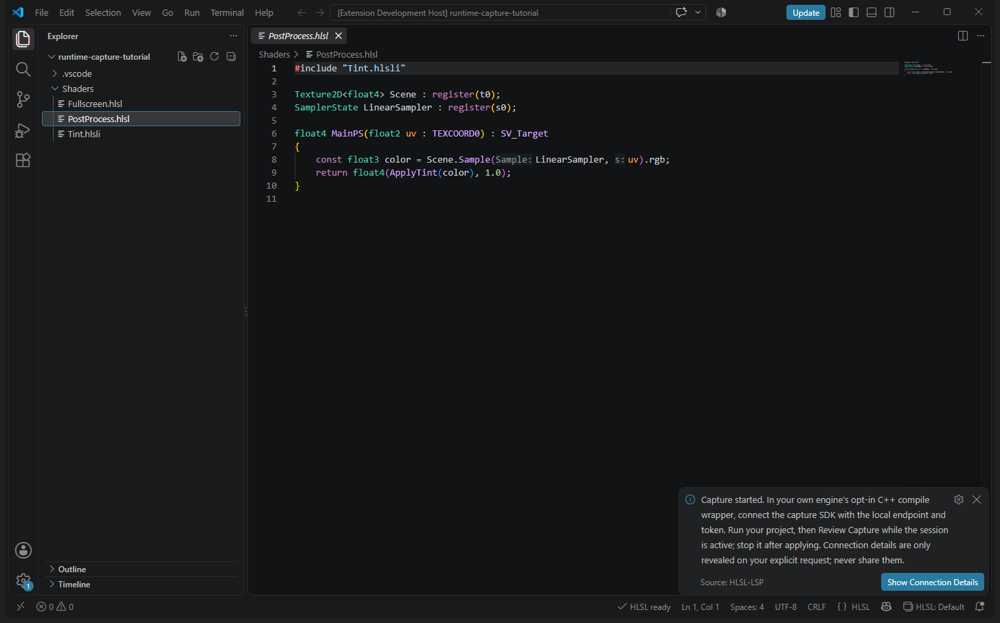
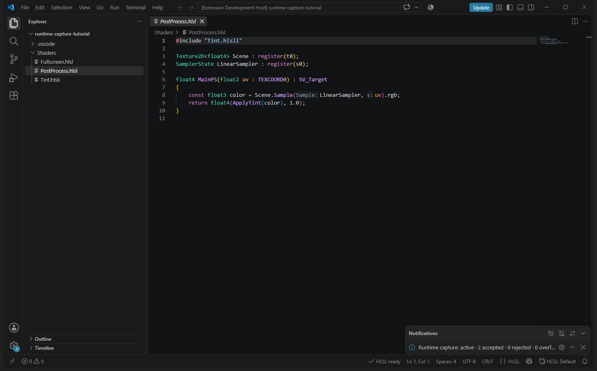
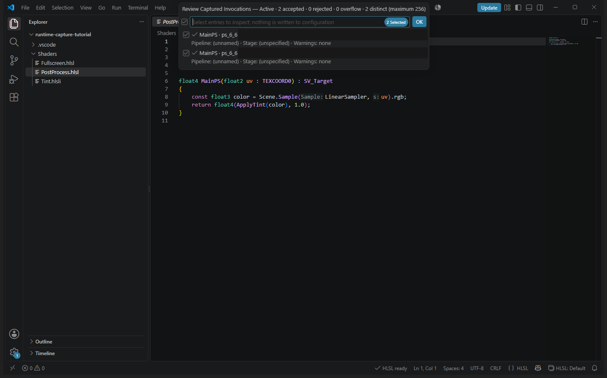
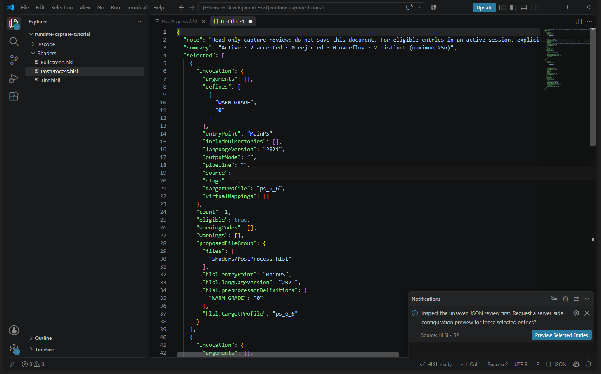
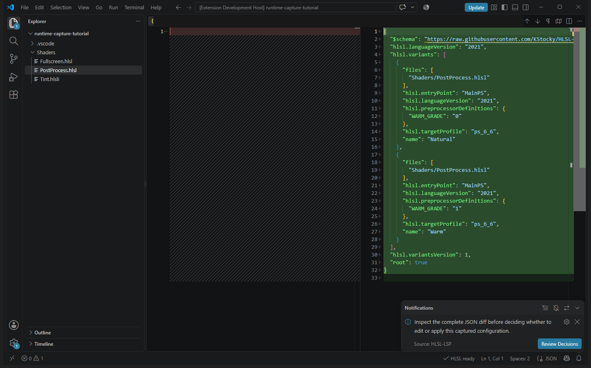
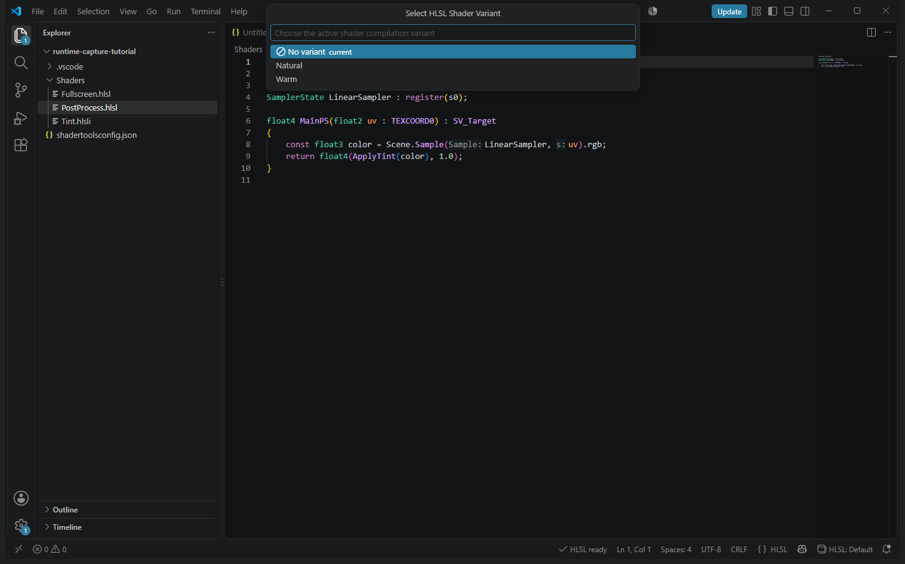

# Tutorial: capture shader compilation requests and create variants

This walkthrough uses the opt-in C++ capture SDK to report two illustrative
compilation requests for the same shader, reviews them in an editor, and
creates `shadertoolsconfig.json` with **Natural** and **Warm** variants. The
screenshots show the real VS Code workflow; Visual Studio uses the same server
and validation rules. Capture never instruments your application or reads its
shader source on its own.

> [!IMPORTANT]
> The standalone SDK example **reports metadata only**. It does not invoke
> DXC or run a game. It illustrates the interface your application's existing
> shader compile wrapper should call with its *actual* request parameters.
> Never treat example reports as evidence that a shader compiled successfully.

## 1. Prepare the workspace and example client

Open [`examples/config-authoring`](../../examples/config-authoring/) as its own
VS Code folder. It contains
[`Shaders/PostProcess.hlsl`](../../examples/config-authoring/Shaders/PostProcess.hlsl)
and the included
[`Shaders/Tint.hlsli`](../../examples/config-authoring/Shaders/Tint.hlsli).
The `WARM_GRADE` define in `Tint.hlsli` selects the natural or warmer color
branch. The starter contains **no** `shadertoolsconfig.json`. For Visual
Studio, put this example beside an open solution and open `PostProcess.hlsl`
there instead.

From the **repository root**, build the example SDK client:

```powershell
cmake --build --preset windows-msvc-debug --target hlsl-capture-example
```

For Linux use `linux-clang-debug` instead. The C++23 example source is
[`examples/capture-client/main.cpp`](../../examples/capture-client/main.cpp);
the public API and integration guidance are in
[runtime compilation capture](../runtime-capture.md#c23-integration).

The tutorial mode accepts one shader path and `both`, `natural`, or `warm`.
`both` queues two `MainPS`/`ps_6_6` requests for the **same file** with
`WARM_GRADE` set to `"0"` and `"1"`, respectively. The original one-argument
SDK example still reports its earlier illustrative `Main`/`ps_6_7` request.
Use an **absolute path to the shader inside the folder open in the editor**.

## 2. Start an opt-in capture session

- **VS Code:** with `PostProcess.hlsl` open, run **HLSL: Start Runtime
  Capture** from the Command Palette. Confirm **Start Capture** in the opt-in
  dialog.
- **Visual Studio:** choose **Tools > Start HLSL Compilation Capture** and
  confirm the opt-in prompt.

The editor opens a local, in-memory session. Choose **Show Connection
Details** when ready to connect your client. Its **endpoint and token are
private**: give them only to your own local process, never put them in a
command line, environment file, source code, Git history, shared terminal,
log, or screenshot. There is intentionally **no screenshot of that dialog**.
Starting another capture replaces the session and invalidates the old token
and reports.



## 3. Report the two example requests

From a **private local terminal**, while the editor's session is active, run
the built example. This PowerShell command assumes your current directory is
the repository root:

```powershell
$shader = (Resolve-Path .\examples\config-authoring\Shaders\PostProcess.hlsl).Path
.\out\build\windows-msvc\Debug\hlsl-capture-example.exe $shader both
```

After its `Disconnected report skipped` message, enter the editor's endpoint
and token on **separate standard-input lines**. The terminal may echo them:
do not screen-share or record it, and clear its scrollback afterward. For a
production integration, supply both privately through your application's
local control channel; do not pass the token in arguments or print it. The
sample disconnects after queueing two reports. In an actual compile wrapper,
connect outside the compilation hot path and call `Client::report(invocation)`
for each **real** compile request without blocking or changing compilation
success based on its best-effort return value. For example, after assembling
your own engine's compile request, map its real fields into the SDK invocation
at the wrapper boundary:

```cpp
hlsl_intellisense::capture::Invocation capture_request;
capture_request.source = request.source_path;
capture_request.entry_point = request.entry_point;
capture_request.target_profile = request.target_profile;
capture_request.defines = request.defines;
(void)capture_client.report(capture_request);
return compile_shader(request);
```

Here `request`, `capture_client`, and `compile_shader` are **your engine's**
objects, not provided by the example. Adapt their types, populate any relevant
include paths, mappings, arguments, and pipeline/stage metadata, and leave
normal shader compilation unchanged. The example's `both` mode instead
*simulates* those two requests expressly for this tutorial.

Choose **HLSL: Show Runtime Capture Status** in VS Code to confirm **active,
2 accepted, 0 rejected, 0 overflow**. Visual Studio exposes its capture
status alongside the capture tools. A repeat request with identical metadata
increments its count rather than creating another distinct entry.



## 4. Review and name the captures

While the session is **still active**, run **HLSL: Review Runtime Capture**
in VS Code, or **Tools > Review HLSL Compilation Capture** in Visual Studio.
Choose **Show eligible, non-transient entries**. Select the two `MainPS /
ps_6_6` entries (the review reports **2 distinct**); do not include unknown
or generated files without checking their warnings and source identities.
The selected-entry picker shows the private local path redacted here:



Confirm to open the **read-only, unsaved JSON review**. Check each invocation,
its count, `eligible`, warning codes, proposed relative `files` pattern, and
`WARM_GRADE` value. The SDK sample has no warnings in this workspace.
This review document is not a configuration: **do not save it**. It may
contain sensitive application paths, defines, or arguments; close it after
review.



Choose **Preview Selected Entries**. Because two distinct requests target
`Shaders/PostProcess.hlsl`, give **each** a unique name: **Natural** for
`WARM_GRADE=0` and **Warm** for `WARM_GRADE=1`. Choose **No pipelines**:
there is no vertex request here, and capture does not infer stage
relationships. In Visual Studio, make the corresponding explicit variant
and pipeline decisions in its review dialog.

## 5. Preview, apply, and save

The server performs a read-only merge and validates the proposed JSON. Review
the **entire diff**, including the relative path and string-valued defines.
This screenshot shows the actual two-variant preview; its temporary workspace
path in the diff title is redacted:



Choose **Review Decisions**, then **Apply Configuration** only if the result
matches your compilation requests. If corrections are needed, choose **Edit
Draft** and **Validate Capture Draft** before applying; the server validates
the whole edited draft. A changed session or configuration buffer invalidates
a stale preview rather than silently replacing your work. The applied result
opens as a normal **unsaved** `shadertoolsconfig.json` document. **Save it**
to persist the configuration.

The generated configuration has `root: true`, the schema, HLSL version
`2021`, `hlsl.variantsVersion: 1`, and these two variants:

```json
"hlsl.variants": [
  {
    "files": ["Shaders/PostProcess.hlsl"],
    "hlsl.entryPoint": "MainPS",
    "hlsl.languageVersion": "2021",
    "hlsl.preprocessorDefinitions": { "WARM_GRADE": "0" },
    "hlsl.targetProfile": "ps_6_6",
    "name": "Natural"
  },
  {
    "files": ["Shaders/PostProcess.hlsl"],
    "hlsl.entryPoint": "MainPS",
    "hlsl.languageVersion": "2021",
    "hlsl.preprocessorDefinitions": { "WARM_GRADE": "1" },
    "hlsl.targetProfile": "ps_6_6",
    "name": "Warm"
  }
]
```

Unlike the [compiler-discovery tutorial](configuration-authoring.md), this
metadata-only exercise creates **variants**, not a vertex-shader file group:
it only reported the pixel shader. To configure `Fullscreen.hlsl`, use guided
**Create/Edit Configuration** as well or report an actual vertex compile
request. You may select one active pixel variant at a time.

## 6. Stop capture and verify the result

Only **after applying and saving**, choose **HLSL: Stop Runtime Capture** in
VS Code or **Tools > Stop HLSL Compilation Capture** in Visual Studio. Stopping
revokes the token and keeps only a final read-only snapshot for review; a
stopped snapshot **cannot** be previewed or applied. Never assume stopping
writes a config file.

Open `Shaders/PostProcess.hlsl` and run **HLSL: Select Shader Variant** in VS
Code, or right-click it and choose **HLSL > Select Shader Variant** in either
editor. Both **Natural** and **Warm** are now available. Choose one and inspect
**HLSL > Shader Compilation**: its effective configuration uses `MainPS`,
`ps_6_6`, and the selected string define. Selecting the other changes the
active permutation; no two variants compile simultaneously.



### Troubleshooting

- **No entries:** confirm capture is active, your SDK client connected to the
  *current* endpoint and token, reports a real file inside the selected
  workspace, and `accepted` increases in capture status.
- **An entry is ineligible:** generated/logical, missing, outside-workspace,
  and nested-configuration sources are reviewable but cannot be merged as
  ordinary disk-backed file groups. Supply a stable logical identity for
  generated shaders rather than inventing a path.
- **A preview is rejected:** two different settings for the same file need
  separate names. Check warnings, existing-config conflicts, and validation
  errors; fix the draft or original config and rerun review **while active**.
- **The variant picker is empty:** save the resulting configuration, open the
  matching shader, and clear editor overrides that take precedence over
  variants. If the session was already stopped, start a new capture to preview
  again.

The [capture protocol reference](../runtime-capture.md) documents session
limits, merge rules, privacy, pipeline grouping, and failure behavior.
